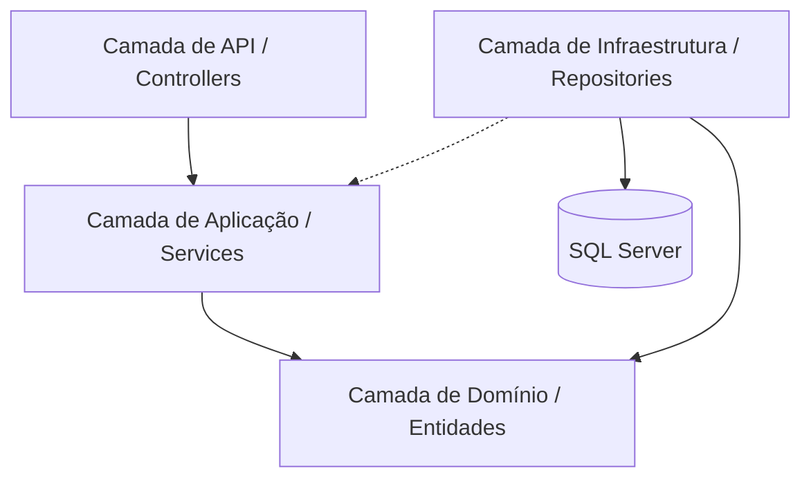

# Documentação de Arquitetura — TCC Contabilidade API

Este documento detalha a arquitetura, decisões de design e fluxos técnicos do backend da Plataforma de Gestão Contábil, desenvolvida como Trabalho de Conclusão de Curso (TCC).

---

## 1. Visão Geral da Arquitetura

O sistema adota uma **Arquitetura em Camadas (Clean Architecture)**, visando a separação de responsabilidades, testabilidade e facilidade de manutenção. O núcleo da aplicação é independente de frameworks externos e detalhes de infraestrutura.

### Diagrama de Camadas

### Responsabilidades das Camadas:

*   **TCC.Contabilidade.API:** Ponto de entrada do sistema. Contém Controllers, Middlewares e configurações de DI (Injeção de Dependência).
*   **TCC.Contabilidade.Application:** Contém a lógica de negócio principal, Interfaces, DTOs e Serviços de Orquestração.
*   **TCC.Contabilidade.Domain:** Coração do sistema. Contém as Entidades de negócio, Enums e Interfaces de Repositório (contratos).
*   **TCC.Contabilidade.Infrastructure:** Implementações de acesso a dados (EF Core), Integrações com APIs externas (CNPJ), Serviços de Cache e Auditoria.

---

## 2. Fluxo de Autenticação e Segurança

A segurança é baseada em padrões modernos para aplicações Web.

### Autenticação JWT (Stateless)
1. O usuário envia credenciais para `/api/Auth/login`.
2. O sistema valida as credenciais e gera um **JWT (JSON Web Token)** assinado.
3. O token contém claims de identidade e permissões (`role`, `tenantId`, `userId`).
4. As requisições subsequentes devem incluir o token no header `Authorization: Bearer {token}`.

### RBAC (Role-Based Access Control)
O sistema utiliza controle de acesso baseado em perfis:
*   **Admin:** Gestão total do sistema e usuários administrativos.
*   **Contador:** Gestão de múltiplas empresas (clientes), criação de obrigações e guias.
*   **Cliente:** Acesso restrito aos dados da sua própria empresa, envio de comprovantes e visualização de relatórios.

### Refresh Token
Para evitar que o usuário seja deslogado frequentemente, implementamos a rota de Refresh Token, permitindo a renovação do Access Token de forma segura sem reenvio de senha.

---

## 3. Arquitetura Multi-Tenant

O sistema é **multi-tenant**, permitindo que diversos escritórios ou empresas utilizem a mesma infraestrutura com isolamento lógico de dados.

### Estratégia de Isolamento
*   **Identificação:** O `tenantId` (ID da Empresa) é extraído do Token JWT via `TenantMiddleware`.
*   **Contexto:** O `ITenantContext` armazena o ID da empresa ativa na requisição.
*   **Filtros Globais:** O `AppDbContext` utiliza o recurso de `Global Query Filters` do Entity Framework Core. Toda entidade que implementa `ITenantEntity` recebe automaticamente o filtro `WHERE EmpresaId = @TenantId` em todas as consultas SQL geradas.
*   **Persistência Automática:** Ao salvar novas entidades, o `AppDbContext` injeta automaticamente o `EmpresaId` do contexto atual.

---

## 4. Auditoria e Rastreabilidade

Para conformidade e segurança, implementamos um sistema de logs de auditoria automatizado.

*   **AuditMiddleware:** Intercepta requisições de modificação (POST, PUT, DELETE).
*   **Registro:** Armazena quem realizou a ação, o IP de origem, a entidade afetada, a operação e o timestamp.
*   **Visualização:** Administradores podem consultar os logs para investigar alterações indevidas ou acompanhar o fluxo de trabalho.

---

## 5. Módulos Principais

### Gestão de Empresas
*   Cadastro via integração com API de CNPJ (ReceitaWS/BrasilAPI).
*   Vínculo de usuários (Contador <-> Clientes).

### Obrigações Contábeis
*   Fluxo de tarefas recorrentes (Folha de Pagamento, Apuração Mensal).
*   Status de controle: Pendente, Em Andamento, Concluída e Atrasada.

### Guias de Pagamento
*   Geração e upload de guias (PDF).
*   Workflow de pagamento: Contador envia guia -> Cliente envia comprovante -> Contador valida pagamento.

### Relatórios e Dashboards
*   Consolidação de dados mensais.
*   Geração de PDFs profissionais para exportação de dados da competência.

---

## 6. Decisões Técnicas de Destaque

1.  **EF Core Interceptors/Filters:** Utilizados para automatizar o multi-tenant e auditoria, reduzindo erro humano.
2.  **DTOs Rigorosos:** Nenhuma entidade de domínio é exposta diretamente na API, garantindo que mudanças internas não quebrem o contrato com o frontend.
3.  **Tratamento de Exceções Global:** Middleware centralizado que formata todos os erros no padrão `ApiResponse`, evitando vazamento de stack traces em produção.
4.  **Rate Limiting:** Proteção contra ataques de força bruta em endpoints de login e registro.

---

## 7. Limitações do MVP e Evoluções Futuras

### Limitações Atuais:
*   **Armazenamento Local:** No MVP, arquivos (PDFs) são armazenados no sistema de arquivos local. Para produção escalável, deve-se migrar para AWS S3 ou Azure Blob Storage.
*   **Banco de Dados Único:** O isolamento é lógico (Shared Schema). Para clientes extremamente grandes, o modelo de banco de dados separado por tenant pode ser necessário.
*   **Integrações Manuais:** Algumas guias dependem de upload manual do contador devido à falta de APIs públicas de alguns órgãos governamentais.

### Roadmap Futuro:
*   Integração direta com prefeituras para emissão de notas fiscais.
*   App mobile para notificações push de vencimentos.
*   Uso de Redis para cache distribuído em ambiente clusterizado.
